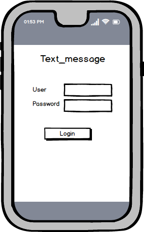

# Text_message
This app is for sending text messages

TODO://` In the **User Stories section below**, add an `x` in the `-[ ]` like this `- [x]` for any user story you complete. (🚫 Remove this paragraph after after checking off completed user stories)

#### REQUIRED (10pts)
- [ ] (10pts) User can view a list of text_message (Title, profil,text,background).

###  User Stories
Our App is there to send text messages to someone
our App is there to launch text messages to someone, there will be a welcome page which is the login, to have a password before being able to enter the application, 
after having logged in, we will find two texts view and a button. one of the text view is to put the number of the person we are going to send the message and the other 
to write the text message, the button is there to send the message in the future we think we are going to put much more structure.

#### BONUS
- [ ] (2pts) Views should be responsive for both landscape/portrait mode.
   - [ ] (1pt) In portrait mode, the  person's profile, background,and the text message.
   - [ ] (1pt) In landscape mode, the rotated alternate layout should use the backdrop image instead and show the title and text messaging
- [ ] (2pts) The app must have the capability for a user to send location data, images, or long messages with no character limit
- [ ] The capacity to send messages or other content to a large number of people(Broadcast or bulk messaging).
- [ ] Illustrées des images ou photographiques que les utilisateurs de l'application de chat peuvent facilement insérer dans leurs conversations au lieu de texte.(Autocollants )
- [ ] (2pts) Improved the user interface by experimenting with styling and coloring.

### App Walkthough GIF
`TODO://` Add the URL to your animated app walkthough `gif` in the image tag below, `YOUR_GIF_URL_HERE`. Make sure the gif actually renders and animates when viewing this README. (🚫 Remove this paragraph after after adding gif)

#### Login Activity
 
#### Send message Activity
 
#### Search Activity
 

